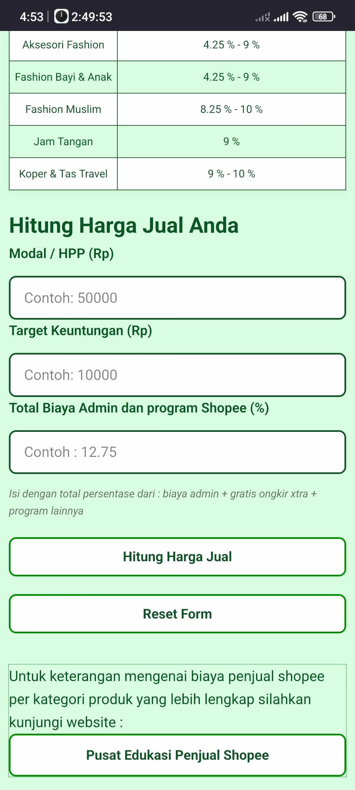

Shopee Pricing Calculator

Kalkulator Pricing untuk Seller Shopee Indonesia. Menghitung harga jual produk secara akurat  
dengan memperhitungkan biaya admin Shopee, program Gratis Ongkir Xtra, dan layanan shopee lainnya.

Klik link live demo ini dan sebuah landing page akan terbuka di browser kesayangan kalian :

Live Demo :  https://sutrisno-u.github.io/shopee-pricing-calculator

## 📸 Screenshots

### Desktop View

### Mobile View

Fitur Utama : 

Kalkulasi Akurat : Rumus (Modal + Profit) ÷ (1 - Total Fee) untuk hasil presisi  
✅ **Input Fleksibel** Langsung input persentase Biaya admin sesuai kategori produk Anda  
✅ **Breakdown Transparan** — Lihat detail : B.admin Shopee, pendapatan bersih atau profit 
✅ **Mobile Responsive** — Desain dioptimalkan untuk tampilan smartphone yang kecil dan mobile
✅ **Validasi Input** — Mencegah kesalahan input dengan validasi real-time  
✅ **100% Gratis** — tanpa iklan, dan tanpa tracking

**Cara Menggunakan**

1. **Input Modal/HPP** — Harga beli atau biaya produksi produk (Rp)
2. **Input Target Keuntungan** — Profit yang diinginkan (Rp)
3. **Input Total Biaya Admin** — Persentase biaya admin Shopee (contoh: 12.75%)
   - Termasuk: biaya admin + gratis ongkir xtra + program lainnya
4. **Klik "Hitung Harga Jual"** — Lihat hasil kalkulasi dengan breakdown yang lengkap

Harga Jual = (Modal + Keuntungan) ÷ (1 - %Total Biaya)
Dimana:
• Total Biaya = Biaya admin + Layanan Shopee (Gratis Ongkir Xtra, dll)
• Biaya admin dalam desimal (contoh: 9% = 0.09)

Modal: Rp 50.000
Profit: Rp 10.000
Fee: 9% (0.09)
Harga Jual = (50.000 + 10.000) ÷ (1 - 0.09)
           = 60.000 ÷ 0.91
           = Rp 65.934

**Stack dan tools yang Dipakai**

- **HTML5** — Semantic markup & accessibility
- **CSS3** — Responsive design, mobile-first approach
- **Vanilla JavaScript** — Ringan dan cepat
- **GitHub Pages** — Hosting gratis & deployment otomatis

Clone Repository

git clone https://github.com/sutrisno-u/shopee-pricing-calculator.git

Buka di Browser :
Cukup buka file index.html di browser favorit Anda.
Atau Gunakan Live Server (VS Code)

    Install extension "Live Server"
    Klik kanan index.html → "Open with Live Server"
    Aplikasi berjalan di http://localhost:5500

v1.0.0 (2026)

    Initial release
    📊 Basic pricing calculator
    📱 Mobile responsive design

👨‍💻 Author
Sutrisno U

GitHub: @sutrisno-u

## 🙏 Acknowledgments

Special thanks to:
- **Seller Shopee Indonesia** — Inspiration & feedback
- **The Odin Project** — HTML/CSS/JS learning resources
- **GitHub Pages** — Free hosting infrastructure
- **Open Source Community** — Tools & endless inspiration

*Dibuat dengan ❤️ untuk UMKM Indonesia*

