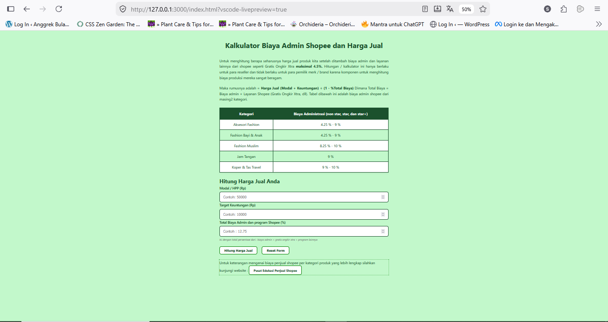

Shopee Pricing Calculator

Kalkulator Pricing untuk Seller Shopee Indonesia. Menghitung harga jual produk secara akurat  
dengan memperhitungkan biaya admin Shopee, program Gratis Ongkir Xtra, dan layanan shopee lainnya.

Live Demo :  https://sutrisno-u.github.io/shopee-pricing-calculator

## 📸 Screenshots

### Desktop View

### Mobile View

Fitur Utama : 

Kalkulasi Akurat : Rumus (Modal + Profit) ÷ (1 - Total Fee) untuk hasil presisi  
✅ **Input Fleksibel** Langsung input persentase fee sesuai kategori produk Anda  
✅ **Breakdown Transparan** — Lihat detail : fee Shopee, penerimaan bersih, dan profit  
✅ **Mobile Responsive** — Desain optimal untuk smartphone seller yang mobile    
✅ **Validasi Input** — Mencegah kesalahan input dengan validasi real-time  
✅ **100% Gratis** — Open source, tanpa iklan, dan tanpa tracking

**Cara Menggunakan**

1. **Input Modal/HPP** — Harga beli atau biaya produksi produk (Rp)
2. **Input Target Keuntungan** — Profit yang diinginkan (Rp)
3. **Input Total Biaya Admin** — Persentase fee Shopee (contoh: 12.75%)
   - Termasuk: biaya admin + gratis ongkir xtra + program lainnya
4. **Klik "Hitung Harga Jual"** — Lihat hasil kalkulasi dengan breakdown lengkap

Harga Jual = (Modal + Keuntungan) ÷ (1 - %Total Biaya)
Dimana:
• Total Biaya = Biaya admin + Layanan Shopee (Gratis Ongkir Xtra, dll)
• Fee dalam desimal (contoh: 9% = 0.09)

Modal: Rp 50.000
Profit: Rp 10.000
Fee: 9% (0.09)
Harga Jual = (50.000 + 10.000) ÷ (1 - 0.09)
           = 60.000 ÷ 0.91
           = Rp 65.934

**Stack dan tools yang Dipakai**

- **HTML5** — Semantic markup & accessibility
- **CSS3** — Responsive design, mobile-first approach
- **Vanilla JavaScript** — Ringan dan cepat
- **GitHub Pages** — Hosting gratis & deployment otomatis

Clone Repository

git clone https://github.com/sutrisno-u/shopee-pricing-calculator.git

Buka di Browser :
Cukup buka file index.html di browser favorit Anda.
Atau Gunakan Live Server (VS Code)

    Install extension "Live Server"
    Klik kanan index.html → "Open with Live Server"
    Aplikasi berjalan di http://localhost:5500

v1.0.0 (2026)

    Initial release
    📊 Basic pricing calculator
    📱 Mobile responsive design

👨‍💻 Author
Sutrisno U
GitHub: @sutrisno-u

🙏 Acknowledgments

    Seller Shopee Indonesia — Untuk inspirasi & feedback
    The Odin Project — Untuk pembelajaran HTML/CSS/JS
    GitHub Pages — Untuk hosting gratis
    Open Source Community — Untuk tools & inspirasi
    
Made with ❤️ for Indonesian UMKM          
